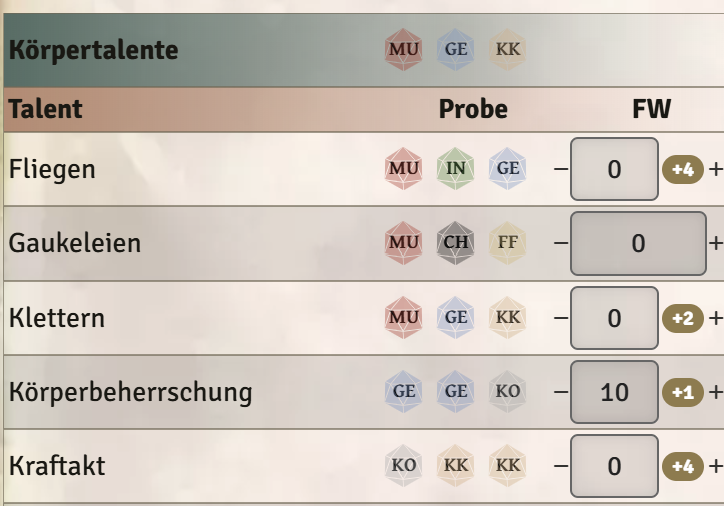
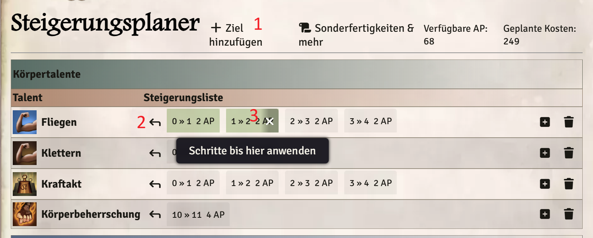
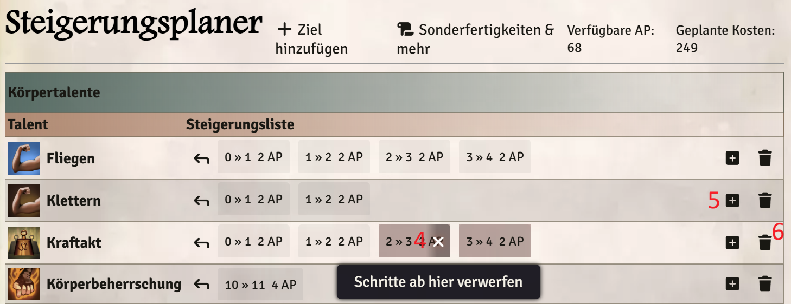
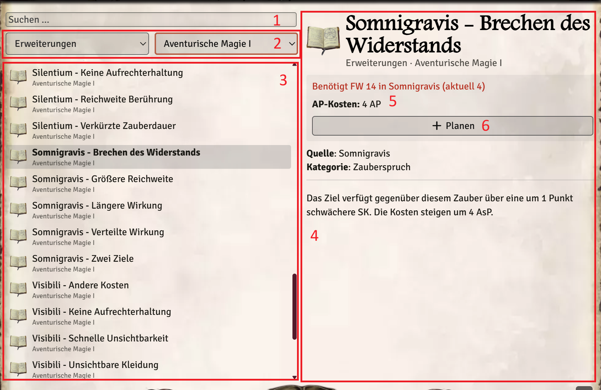
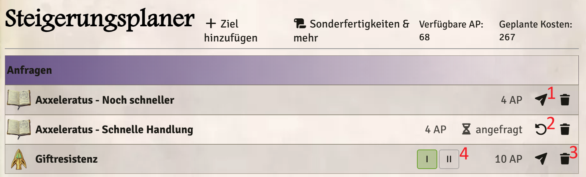

# DSA5 - Steigerungsplaner

Ein Foundry-VTT-Modul für das [DSA5-System](https://github.com/Plushtoast/dsa5-foundryVTT), mit dem die Spieler ihre Steigerungen planen können, statt sie sofort auszuführen. Neue Sonderfertigkeiten, Vor- und Nachteile, Zauber, Liturgien und mehr lassen sich ebenfalls planen und beim SL anfragen.

## Was macht das Modul?

Im DSA5-Charakterbogen steigert ein Klick auf "+" sofort und zieht die AP direkt ab. Der Steigerungsplaner fügt dem Bogen einen zweiten Modus hinzu:

- **Steigerungen planen** per Shift-Klick auf "+"/"-" oder durch Eintippen des gewünschten Werts, ohne dass AP abgezogen werden.
- **Einen eigenen Tab "Steigerungsplaner"**, der alles Geplante mit AP-Kosten zeigt und von dem aus man es Schritt für Schritt anwendet.
- **Anfragen beim SL** für Neues wie Sonderfertigkeiten, Vor- und Nachteile, Zauber oder Liturgien, inklusive eines Fensters, in dem der SL sie genehmigt oder ablehnt.

Planen können alle Spieler mit **Besitzer**-Rechten (Owner) auf den Charakter, der SL ist das automatisch. Beobachter sehen den Tab gar nicht.

## Planen im Charakterbogen

Ein **Ziel** ist ein Wert, den man steigern kann: ein Talent, eine Kampftechnik, ein Zauber, eine Liturgie, eine Eigenschaft, ein Basiswert (Lebenskraft/Astralenergie/Karmaenergie) oder der Rückkauf permanenter AsP/KaP.

- **Shift-Klick auf "+"** neben einem Ziel plant die nächste Steigerung, statt sie auszuführen.
- **Shift-Klick auf "-"** nimmt die zuletzt geplante Steigerung wieder zurück. Ist nichts geplant, plant er stattdessen eine Verringerung, z. B. um Punkte von einem Talent auf ein anderes umzuverteilen. Umgekehrt nimmt Shift-Klick auf "+" eine geplante Verringerung zurück.
- **Eine Zahl ins Wertfeld eintippen** (bei Eigenschaften und Basiswerten ins Feld für die Steigerungen) plant die Steigerungen bis zu diesem Zielwert. Bereits Geplantes wird dabei ergänzt oder gekürzt, eine kleinere Zahl plant Verringerungen. Der Bogen zeigt danach weiter den echten Wert. Der SL kann mit **Strg+Enter** den Wert wie gewohnt direkt setzen.
- Neben jedem "+" zeigt ein kleines **Badge**, wie viele Schritte für das Ziel geplant sind (z. B. `+3`, bei Verringerungen rot `-2`), mit den Details im Tooltip. Der Tooltip der "+"/"-"-Buttons erinnert an den Shift-Klick.



Steigert man ganz normal (ohne Shift) ein Ziel, für das Schritte geplant sind, wird der passende Schritt aus dem Plan genommen. Nimmt man so eine Steigerung per "-" wieder zurück, kommt der Schritt zurück in den Plan. Das klappt, solange man den ursprünglichen Plan noch abarbeitet. Ist er komplett angewendet oder wurde Neues dazugeplant, vergisst der Planer das beim Schließen des Bogens.

Wird ein Wert direkt gesetzt (Strg+Enter oder mit ausgeschalteter Einstellung), passt der Planer die Planung sofort an: Erreichte Schritte verschwinden, der Rest bleibt. Ändert sich ein Wert auf anderem Weg so, dass die Planung nicht mehr passt, verwirft der Planer sie mit einem Hinweis.

## Im Steigerungsplaner-Tab

Oben steht, wie viele AP **frei** und wie viele schon **verplant** sind. Darunter alle geplanten Schritte, gruppiert wie im Talente-Tab (Körper-, Gesellschafts-, Natur-, Wissens- und Handwerkstalente, Kampftechniken, Zauber, Liturgien, Eigenschaften, Basiswerte, Sonstige).

Die Schritte eines Ziels bauen aufeinander auf (z. B. Kraftakt 5→6, dann 6→7). Angewendet wird deshalb immer von vorne. Die Bedienelemente:

- **"Wert planen"** (1) oben im Tab: öffnet eine durchsuchbare Liste aller Ziele, für die noch nichts geplant ist, und plant für das gewählte die erste Steigerung.
- **Pfeil neben den Kacheln** (2): wendet den vordersten Schritt an, also die echte Steigerung inklusive AP-Abzug.
- **Klick auf eine Kachel** (3): wendet alle Schritte bis einschließlich dieser an, so weit die AP reichen.
- **X einer Kachel** (4): verwirft diesen und alle folgenden Schritte.
- **Kästchen mit Plus** (5): hängt den nächsten Schritt an.
- **Mülleimer** (6): verwirft alle geplanten Schritte für dieses Ziel (mit Rückfrage).

Schritte, für die die verfügbaren AP gerade nicht reichen, werden abgedunkelt. Beim Überfahren zeigt der Tab vorher an, was ein Klick bewirkt: grün, was angewendet wird, rot, was verworfen wird.





## Sonderfertigkeiten, Vor- und Nachteile, Zauber & mehr

Neues kauft man nicht Schritt für Schritt, sondern bekommt es vom SL genehmigt. Dafür gibt es oben im Tab den Button **"Katalog"**. Er öffnet ein Fenster mit allem, was der Charakter lernen könnte:

- Vor- und Nachteile, Sonderfertigkeiten (allgemein, Kampf, magisch, karmal), Zauber, Rituale, Zaubertricks, Liturgien, Zeremonien, Segnungen und Erweiterungen. Dazu höhere Stufen von Sonderfertigkeiten und Vorteilen, die der Charakter schon hat.
- Magisches sehen nur Zauberer, Karmales nur Geweihte. Erweiterungen erscheinen für Zauber und Liturgien, die der Charakter beherrscht oder geplant hat.
- Die Liste stammt aus allen Kompendien, die der Spieler sehen darf, und berücksichtigt den Modulfilter der Bibliothek. Beim ersten Öffnen pro Sitzung wird sie einmal geladen und im Cache zwischengespeichert.

Im Fenster kann man nach Einträgen **suchen** (1), ab drei Buchstaben auch in den Beschreibungen (diese Treffer stehen ausgegraut am Ende ihrer Gruppe), und nach **Kategorie oder Buch filtern** (2). Die Ergebnisse stehen in der **Liste** (3) darunter, unter jedem Eintrag das Buch, aus dem er stammt. Wählt man einen Eintrag aus, sieht man rechts die **Details** (4): Voraussetzungen, Regeltext und Beschreibung, darüber die **AP-Kosten** und bei Erweiterungen den nötigen FW (5). Bei Bedarf wählt man dort auch Stufe und Variante (z. B. das Talent bei einer Begabung), bei Zaubern und Liturgien den **Ziel-FW**, auf den man sie nach dem Erlernen steigern will. Mit einem Klick auf **"Planen"** (6) kommt der Eintrag in den Plan.



Geplante Einträge stehen im Tab unter **"Anfragen"**, mit ihren geschätzten AP-Kosten. Sortiert sind sie nach Art (Vor- und Nachteile, Sonderfertigkeiten, Magisches, Karmales) und darin alphabetisch, Erweiterungen stehen so direkt bei ihrem Zauber. Sie zählen in die verplanten AP mit und werden abgedunkelt, wenn die AP nicht reichen.

- **Papierflieger** (1): fragt den Eintrag beim SL an. Solange er dort liegt, lässt er sich nicht ändern, aber mit dem **Rückgängig-Pfeil** (2) zurückziehen.
- **Mülleimer** (3): verwirft den Eintrag.
- **Erweiterungen** lassen sich schon planen, wenn ihr Zauber oder ihre Liturgie erst geplant ist. Anfragen kann man sie aber erst, wenn der Charakter den Zauber beherrscht und dessen FW reicht, bis dahin ist der Papierflieger gesperrt und der Tooltip sagt, was fehlt. Wird der Zauber aus dem Plan genommen, bleibt die Erweiterung stehen und bekommt ein Warndreieck.
- **Stufen-Buttons** (4) bei gestuften Einträgen: ändern die geplante Stufe. Der Tooltip zeigt, wie sich die Kosten dadurch ändern.
- **Ziel-FW** bei Zaubern, Ritualen, Liturgien und Zeremonien: der FW, auf den man nach dem Erlernen steigern will. Daneben steht, was die Steigerungen zusätzlich kosten, sie zählen in die verplanten AP mit. Der SL genehmigt nur das Erlernen und sieht den Ziel-FW nicht. Nach der Genehmigung stehen die Steigerungen als normale Schritte im Plan.



Genehmigt oder lehnt der SL ab, bekommt der Spieler eine Benachrichtigung. Ein abgelehnter Eintrag steht wieder als geplant im Tab, mit dem Hinweis "abgelehnt" und der Begründung im Tooltip. Bekommt der Charakter einen geplanten Eintrag auf anderem Weg (z. B. zieht der SL das Item direkt auf den Bogen), verschwindet er von selbst aus dem Plan.

## Für den SL

- Die **Übersicht** zeigt für jeden Spielercharakter, der etwas geplant hat, einen Block mit freien und verplanten AP (rot, wenn mehr verplant ist als frei). Offene Anfragen stehen ganz oben in einer grünen Karte mit Variante, Stufe, geschätzten Kosten und Voraussetzungen, sie bleiben auch bei eingeklapptem Charakter sichtbar. Darunter die Planung als Kacheln, zuerst die Einträge aus dem „Katalog“, die noch nicht angefragt sind (inklusive Ziel-FW), dann die geplanten Steigerungen mit Start- und Zielwert in denselben Abschnitten wie im Planer-Tab. Charaktere mit offenen Anfragen stehen oben, ein Klick auf den Namen öffnet den Charakterbogen im Steigerungsplaner-Tab.
- Über den Button **"Planer"** im Akteure-Verzeichnis lässt sich die Übersicht jederzeit öffnen. Beim Login, wenn etwas offen ist, und sobald ein Spieler etwas anfragt, öffnet sie sich von selbst, dann mit dem Filter **"Nur offene Anfragen"**, und schließt sich wieder, wenn nichts mehr offen ist. Hat der SL sie selbst geöffnet oder den Filter umgestellt, bleibt sie offen.
- **Haken** an einer offenen Anfrage: genehmigt sie und kauft den Eintrag über die Funktionen des Systems, genau wie beim Ziehen auf den Bogen (AP-Prüfung, Abzug, AP-Tracker), nur ohne erneute Variantenauswahl.
- **Verbotsschild**: lehnt ab, optional mit Begründung.
- Im Steigerungsplaner-Tab eines Charakters sieht der SL statt des Papierfliegers direkt den Haken und kann geplante Einträge ohne Umweg kaufen.
- Werte direkt setzen: im Wertfeld mit **Strg+Enter** (siehe oben) oder über die Einstellung unten.

## Einstellungen

- **Eingabefelder planen Steigerungen** (Welt, standardmäßig an): Ist sie aus, setzen die Wertfelder den Wert wieder direkt, wie ohne das Modul. Bereits Geplantes wird dabei an den neuen Wert angepasst. Praktisch z. B. beim Erschaffen von Charakteren.

## Voraussetzungen

- Foundry VTT **Version 14**
- System [**DSA5**](https://foundryvtt.com/packages/dsa5)
- Modul [**libWrapper**](https://foundryvtt.com/packages/lib-wrapper) (wird als Abhängigkeit automatisch mitinstalliert/vorausgesetzt)

## Installation

1. Im Foundry-Modul-Browser nach "Steigerungsplaner" suchen, **oder**
2. über den Manifest-Link installieren:
   ```
   https://github.com/Lyynix/dsa5-steigerungsplaner/releases/latest/download/module.json
   ```
3. Modul im gewünschten Foundry-Welt-Setup aktivieren (libWrapper muss ebenfalls aktiv sein).

## Kurzanleitung

1. Charakterbogen eines eigenen Charakters öffnen.
2. Steigerungen planen: per **Shift-Klick auf "+"** (oder "-" für Verringerungen), durch Eintippen des Zielwerts ins Wertfeld oder im Tab **"Steigerungsplaner"** über **"Wert planen"** (siehe [Planen im Charakterbogen](#planen-im-charakterbogen)).
3. Im Tab **"Steigerungsplaner"** das Geplante ansehen, ergänzen, anwenden oder verwerfen (siehe [Im Steigerungsplaner-Tab](#im-steigerungsplaner-tab)).
4. Neue Sonderfertigkeiten, Vor- und Nachteile, Zauber usw. über den **"Katalog"** planen und beim SL anfragen (siehe [Sonderfertigkeiten, Vor- und Nachteile, Zauber & mehr](#sonderfertigkeiten-vor--und-nachteile-zauber--mehr)).

## Bekannte Einschränkungen

- Der Planer ist auf Charakterbögen (`character`) beschränkt; NSC-, Kreatur- und Fahrzeugbögen werden nicht unterstützt.
- Voraussetzungen werden nicht geprüft. Das System speichert sie nur als Freitext und prüft sie selbst auch nicht, die Entscheidung liegt beim SL.
- Die AP-Kosten von Anfragen sind eine Schätzung. Manche Varianten ändern die Kosten, und freie Sprachpunkte werden erst beim Kauf verrechnet. Es gilt, was das System beim Genehmigen abzieht.

## Mitentwickeln

Issues und Pull Requests sind willkommen. Wie wir dabei arbeiten, steht in [CONTRIBUTING.md](CONTRIBUTING.md).
